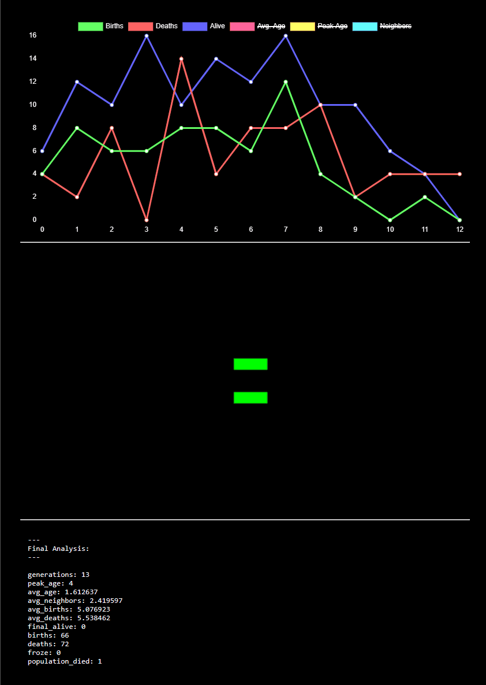

An Analytical Cellular Automata Simulator in C++.

Outputs GIFs and CSV analysis of the simulation results. 


---
# Analysis Files

The purpose of this simulation software is not primarily to generate cool looking gifs but is instead intended to allow for a deeper level of analysis and understanding of the simulation results. 

To facilitate this, the program will output not only a gif but a `<simulationName>.html` analysis file. This file includes several metrics about the results of your simulation. 



This analysis file takes advantage of the powerful JavaScript library [Charts.js](https://www.chartjs.org/) to graph the time (generational) domain analysis. All of the actual analysis is done in C++. This output file will run in your local browser without the need for a web server. Just open it with your browser of choice. The underlying data is exposed in the HTML file in a way that would make it easy to your data with other tools such as [Plotter](http://www.graphreader.com/plotter), [Desmos](https://www.desmos.com/calculator) or [MatLab](https://www.mathworks.com/products/matlab.html).

---
# Configuration

The program will look for a cfg.txt file in the working directory. 

The file might look something like this:

```
# Example config
# Comments are ignored
# Output file name
file = life
# Gif frame delay
delay = 16
# Frames to render
frames = 64
# Generations to run before render
pre = 0
# Canvas width
width = 32
# Canvas height
height = 32
# Pixel / Image scale
scale = 8
# Gif color pallet
pallet = rainbow3
# Rule set
rules = dstd
---
# .sorg settings
---
# File to load
sorg = 2to1
# Center (0 or 1)
#sorg_center = 0
# X offset (can be negative)
#sorg_x = 1
# Y offset (can be negative)
#sorg_y = 1
```

Note: Lines beginning with `#` or `-` are ignored. So are empty lines.

---

# The `.sorg` File Type

## Specifications
- Lines beginning with `#` are comments and are ignored.
- Spaces are removed from lines before they are read or counted
- Each character represents one cell
- The following characters represent a cell which is off `0`,`O`,`o`
- Any other character aside from `#` is considered to be on
- A line that contains # but does not start with # is an error and the file will be rejected  
- Width is determined by counting the (string) size of the first row
- Any row with a size greater than the first row is an error and the file will be rejected
- Height is determined by counting the number of rows 

Note: comments are really only intended to be used at the top of the file. 

## Noise
You can also generate pseudo-random noise as your starting "organism" by adding simply writing `sorg = noise`. This means that `noise`. This means that a `.sorg` file cant not be named `noise`. It is a reserved name. 

## Example
An example `.sorg` file might look like this:

```
# A simple oscillator
1100
1100
0011
0011
```

This file would be calculated to have a `width` of 4 and a `height` of 4.

A more complex example might look like this:
```
000000000000000000111000111
000000000000000000101000101
000010000000000000111000111
000111000000000000000000000
000101000000000000000000000
000111000000000000000000000
000010000000000000111000111
000000000000000000101000101
000000000000000000111000111
```

This file would be calculated to have a `width` of 27 and a `height` of 9. 

---

# Rules
There are 4 conditions for which we must specify a "rule". A rule is a combination of a condition and an "action". 

Each condition relates to the amount of "neighbors" a cell has. A cell is considered to have a neighbor if another living cell is touching it on its sides or corners.

In this example the cell "C" has 3 neighbors.
```
100
0C1
100
```

The conditions are as follows:

1. Neighbors < 2
2. Neighbors = 2
3. Neighbors = 3
4. Neighbors > 3

When one of these conditions is met, we need to take an "action". 

There are 3 possible actions that can be taken:

1. Survive: A living cell continues to live.
2. Thrive: A living cell continues to live. If the position is unoccupied (no living cell lives here) then a new cell is born at this position.
3. Die: A living cell will die.

Note: There is no functional difference between a dead cell and an empty cell. 

We can also call these rules by the first character of their name:

```
s = Survive
t = Thrive
d = Die
```

Considering that we always need to define exactly 4 rules, we can think of a rule set as being any string with a length of 4 characters that contains only the characters "s", "t" and "d". 

For example, the rules for Conway's Game of Life would be:

```
dstd
```

This would translate to:
1. Neighbors < 2 -> Die
2. Neighbors = 2 -> Survive
3. Neighbors = 3 -> Thrive
4. Neighbors > 3 -> Die

We can use this method to define any possible rule set. However, it is important to note that each condition can only have 1 rule and each rule set must have exactly 4 rules.

An interesting alternative to Conway's rule set is:
```
dttd
```

Alternate rule sets can lead to some very interesting results. For instance by using the rule set `dttd` with a starting configuration like:

```
010
111
101
111
010
```

We will get output like this:


## Meta Rules

Meta rules are rules that exist outside the context of the cells themselves. These rules are coded into the simulation and can not be changed via the config file. 

**Population Death:** A population is considered "dead" when all cells have died. There will be no meaningful data in the next generation so the simulation will stop. 


When the population freezes, there will be an output in the terminal that indicates this. The `froze` metric in the analysis file will be set to `1`. 

**Population Freeze:** Cells can be alive, but fully inactive. Cells in this state are called "frozen". A population is frozen when an entire generations passes without any new births or deaths. When this happens we can be sure that on any subsequent generations, there will also be no new births or deaths. And thus no new data that would care about. We can safely assume that each cell will continue living ad-infinitum and age towards infinity. When the population is frozen, the simulations stops.   


When the population dies, there will be an output in the terminal that indicates this. The `population_died` metric in the analysis file will be set to `1`. 